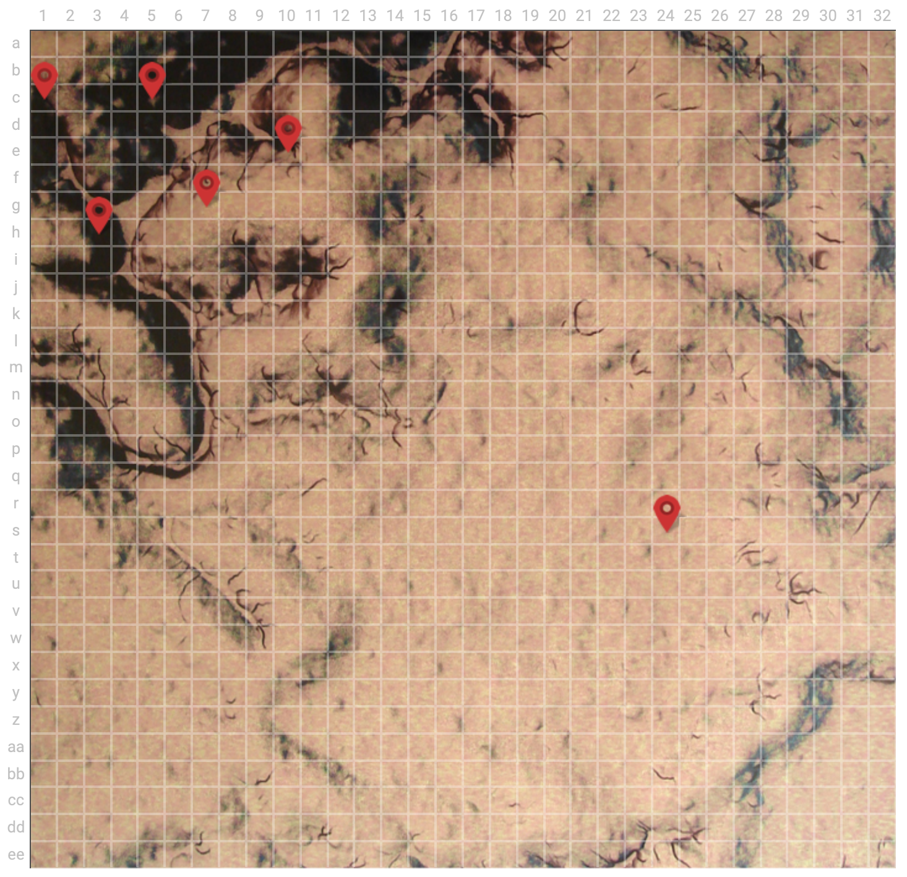
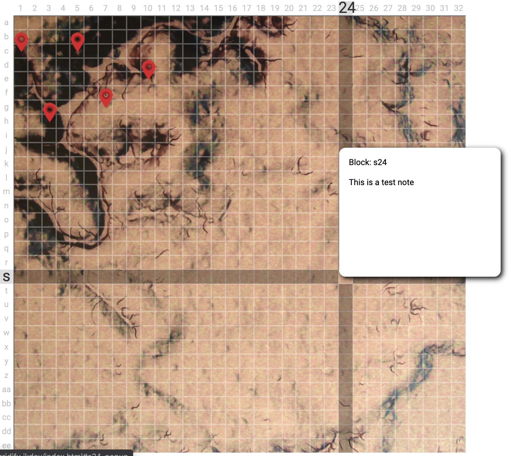

# About


Gridify is a simple jQuery plugin that gives the ability to turn any image into a grid. Here's an example of how to initialize Gridify on an image. You can pass in either a relative or absolute image path.

```
<div id="map"></div>
<script type="text/javascript">
  $('#map').gridify({
    mapName: 'desert',
    showGrid: true,
    cols: 32
  });
</script>
```

Gridify also allows a user to click on a tile and place pins. There is an optional modal that can be displayed to take notes for individual tiles that are saved inside of the images corresponding JSON file for persistent data.

This was a pretty basic tool developed to use for games like Dungeons and Dragons, Rainbow Six Siege, or anything that could use an informational map.

# Examples





# Options

Gridify takes the following options

- **mapName**: Required string name of the current map instance.
- **image**: Required image path. Can be relative or absolute.
- **cols**: Number of rows and columns. Defaults to 12.
- **clickable**: Whether or not the grid is clickable. Allows pins to be placed. Defaults to true.
- **allowPopups**: Whether or not notes can be added to the pin locations. Defaults to true.
- **pinImg**: Required for clickable grids. Can be a relative or absolute image page.
- **showGrid**: Whether or not to display the grid lines. Defaults to false.

## License
[MIT](https://choosealicense.com/licenses/mit/)
